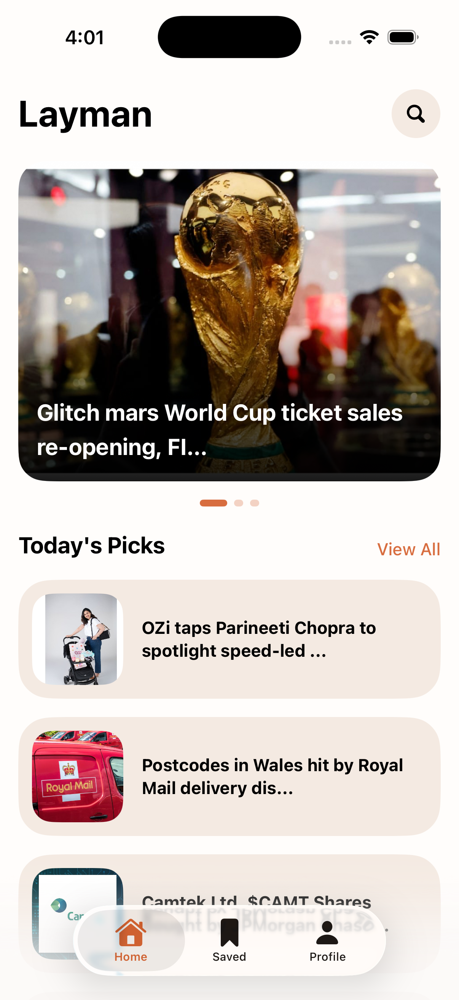
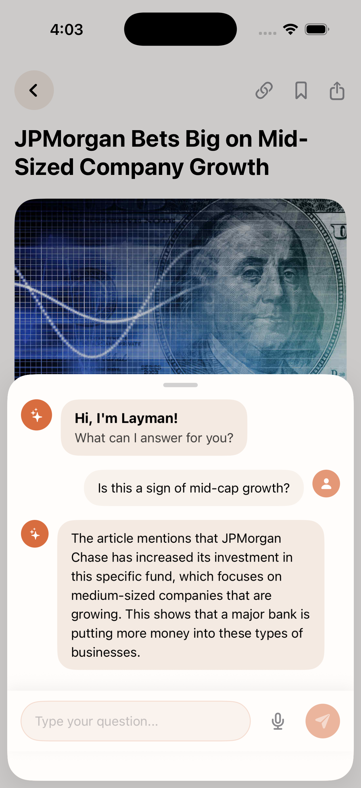

# Layman 📱
**Business, Tech & Startups — Made Simple.**

Layman is a premium iOS news aggregator designed to strip away the jargon. Powered by Google Gemini AI, it transforms complex industry news into clear, digestible summaries that anyone can understand.

## 🎥 Demo Video
[Watch the Layman App Demo on Google Drive](https://drive.google.com/file/d/1USAfkBsUIPrdkUj-vEqZvlTzMVMmDkxY/view?usp=sharing)

## ✨ Features

### 🤖 AI Simplification Engine
*   **Gemini Integration**: Every article is processed by Google's Gemini Pro API to generate layman-friendly headlines and key insight cards.
*   **Byte-Sized Learning**: Skip the long-form fluff and get the core facts in seconds.

### 📶 Offline-First Architecture
*   **SwiftData Persistence**: Your bookmarked articles are stored locally using Apple's modern SwiftData framework.
*   **Full Fidelity Offline**: We cache not just the text, but also the binary image data and the AI-generated summaries. Read your saved news on an airplane with zero latency.
*   **Smart Sync**: Background synchronization seamlessly merges your local device data with the Supabase cloud.

### 🔍 Powerful Discovery
*   **Live Search**: Real-time filtering in both the Home feed and your Saved collection.
*   **Curated Categories**: Focused on Technology, Business, and Startups via the NewsData.io API.
*   **Featured Carousel**: A high-fidelity, swipeable header for the day's most critical stories.

### 🛡️ Security & Scalability
*   **Supabase Backend**: Secure authentication and real-time database management.
*   **Secrets Management**: API keys and sensitive credentials are isolated in `.xcconfig` files and mapped via `Info.plist`, ensuring no leaks to version control.
*   **Have Added Voice Chat in AI Bot.

## 🛠️ Tech Stack
- **Framework**: SwiftUI (iOS 17+)
- **Database (Local)**: SwiftData
- **Database (Cloud)**: Supabase (PostgreSQL + RLS)
- **AI/LLM**: Google Gemini AI
- **Authentication**: Supabase Auth
- **News Source**: NewsData.io API

## 🚀 Getting Started

### Prerequisites
- Xcode 15.0 or later
- iOS 17.0+ Simulator or Device
- Supabase account (for Auth & DB)
- Gemini API Key
- NewsData API Key

### Installation

1. **Clone the repository**
   ```bash
   git clone https://github.com/adityam2003/Layman-App.git
   cd Layman-App
   ```

2. **Configure Secrets**
   Create a file at `Config/Secrets.xcconfig` and add your keys:
   ```text
   SUPABASE_URL = your_supabase_url
   SUPABASE_ANON_KEY = your_anon_key
   GEMINI_API_KEY = your_gemini_key
   NEWS_API_KEY = your_newsdata_key
   ```

3. **Open in Xcode**
   Open `Layman.xcodeproj` and ensure the `Config/Info.plist` is correctly mapped in the Build Settings.

4. **Build & Run**
   Press `Cmd + R` to start the app!

## 📸 Screen Previews
| Home Feed | AI Detail | Article Content |
| :---: | :---: | :---: |
|  |  |  |


---
